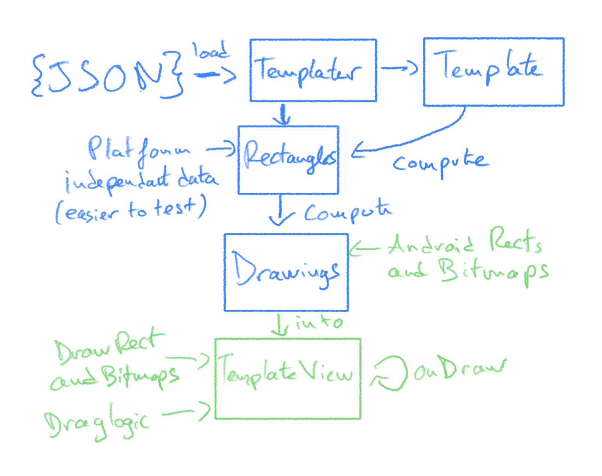

# Mojo technical test

## Process

Since this is a time constrained project with a lot of small geometry problem solving, I decided to work by quickly implementing imperfect solutions that work, adding some tests and then refactoring to make it cleaner

I ran a bit out of time so the refactor is not ideal and the test coverage is not great as well, also because a lot of the code relies
on Android framework classes for graphical rendering which I partly abstracted away but not as much as I would like

## Architecture

I have not made a full architecture since the project is fairly small and I was time constrained but I tried to create a simple and usable API, similar to `Glide`: `Templater.get().load(R.raw.json).into(templateView)`

Basically you get an instance of `Templater` that you can use to `load` a `Template` (the objects defined in JSON) `into` a `TemplateView`

In more details:

- `load` parses the Json into a `Template` class that has its own logic to compute a list of `Rectangle` that are a platform independent representation of a Canvas view
- then in `into`, `Templater` computes those `Rectangles` back into Android instances like `Rect`, `RectF`, `Bitmap`, ... and gives them to `TemplateView`
- `TemplateView` then draws them on the canvas when it's ready (thanks to a custom setter with `postInvalidate()`)
- bitmaps are drawn on the canvas with `drawBitmap(bitmap, src, dest, paint)`: `src` describes the part of the bitmap that is projected and `dest` is the `Rect` in which the bitmap is projected
- The bitmap dragging handling is done inside of `TemplateView`: `onTouch`, user inputs modify `src` to offset the bitmap visible part.

I made a simple `ServiceLocator` instead of a real Dependency Injection solution because it was enough for a small project

I focused mainly on offloading as much work as possible away from the main thread and from `onDraw` so that it does only drawing, no allocations, etc

Ideally, I would have wanted to:

- correctly interface and inject classes to allow full test coverage
- remove most logic from `Template` and keep it as a simple data class
- abstract the fragging logic away from `TemplateView`
- extract all the "engine" code into its own module and keep `app` as just a sample
- implementing two-finger gestures to scale bitmaps
- try to implement it in Compose !

## Dependencies

- `KotlinX Serialization` to parse JSON with a simple syntax
- `Glide` to fetch images as Bitmaps easily
- `Kotlin` Coroutines for simple async work
- [Picsum](https://picsum.photos/) to fetch random images
